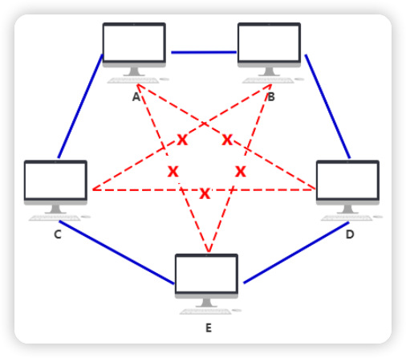
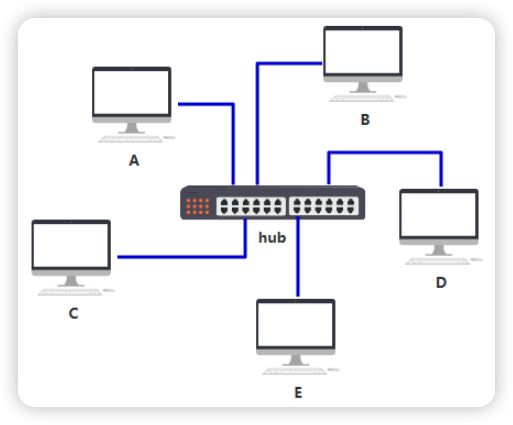

链接：https://www.cnblogs.com/flashsun/p/14266148.html

## 个人打分
⭐️⭐️⭐️⭐️⭐️

## 阅读时间
2024/10/24 - 2024/10/24

## 读书心得

### 物理层
通过一根网线，实现两台电脑互相通讯，网线插在电脑的网口上。三台电脑互相通讯时，每台电脑都需要两个网口。
假如五台电脑呢？每台电脑都需要四个网口。这是不现实的。

于是你发明了一个设备，**集线器**。有了集线器，网线变得简洁多了~
发送数据，发给集线器即可，集线器会无脑的将电信号广播到所有插网线到它的电脑，不做任何处理。它笨笨的，所以把它定性在**物理层**。

假如，A 给 B 发数据，数据包如何知道，是不是发给我的呢？
给电脑起个名字吧！这个名字需要全局唯一，你把这个名字称为 **MAC 地址**。
有名字以后，A 给 B 发数据时，在数据包中拼接一个头部，就可以了。

新的问题出现了，A 只需要给 B 发数据，现在发给集线器以后，所有电脑都会收到，这不安全，也不节省网络资源。

### 链路层
