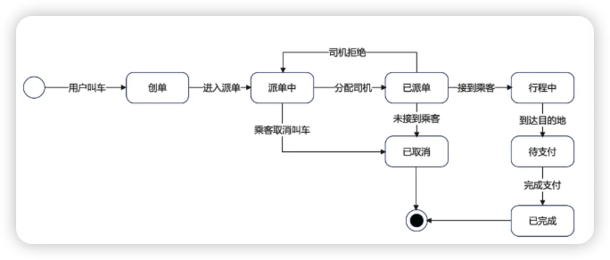
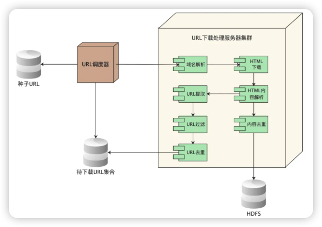

链接：https://mp.weixin.qq.com/s/AQWckbTwamt3tISh-bKxxQ

## 个人打分
⭐️⭐️⭐️

## 阅读时间
2024/11/06 - 2024/11/06

## 读书心得

### 画图工具

- https://excalidraw.com/ ，简单、快
- https://icraft.gantcloud.com/zh-CN ，3D 的，看着炫，画部署图不错
- https://app.diagrams.net/ ，好用，就是需要适应它调整样式的方式，时序图推荐用它

### 时序图

用于描述参与者之间的动态调用关系。

> 动态调用，强调**系统运行时**对象之间的交互过程；静态调用，强调**系统结构**层面的关系。

参与者下的垂直虚线，称作生命线，生命线上的矩形条，称作激活条。

使用场景：描述系统或组件之间的流程逻辑、调用关系。

### 状态图

单个对象生命周期的状态变迁。

每种状态之间变迁的原因，画这种图可以清晰的表示。

使用场景：对象内部会有复杂的状态变化。

### 部署图

部署图描述软件系统的最终部署情况。比如，需要部署多少服务器，关键组件都部署在哪些服务器上，现有的系统服务器的关系，和第三方服务器的关系。

使用场景：现有的系统服务器的关系，和第三方服务器的关系；让团队了解系统运行在物理上是什么样子。