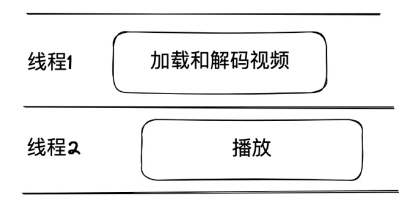
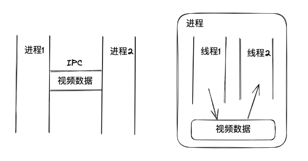
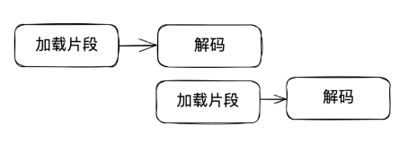

链接：https://mp.weixin.qq.com/s/Tq5a7_gF-rHeEz6AxH8iXQ

## 个人打分
⭐️⭐️⭐️⭐️

## 阅读时间
2024/10/29 - 2024/10/29

## 读书心得
以加载视频资源的场景为例。

进程的作用是，让播放视频的代码运（进）行起来。

播放视频前，需要缓冲（加载和解码等）视频，我们可以让进程中的不同线程完成播放视频所需工作。A 进程中的 a 线程加载和缓冲，b 线程播放。如下图。

为什么不新创建 2 个进程来完成 a 和 b 线程的工作呢？
因为进程间通信（交换数据）相比线程间通信麻烦的多。如下图。

线程间通信，它们会共享数据。共享数据需要注意**共享资源覆盖问题**，引起该问题有两点：
1. 线程切换（上下文切换）
2. 非原子命令

最后是协程，协程实际上可以将加载和解码视频的工作粒度再次拆分（一个线程之前需要完成加载和解码视频），拆分的原则是，**协程可以挂起**，这样能加快视频加载的事件。如下图。

但线程不也能达到同样的效果吗？不用线程，是因为线程执行加载操作，主要是 I/O 操作，几乎不消耗 CPU 资源，但执行线程会阻塞，另外创建线程本身有开销，切换也有开销，相比之下，协程的开销极小，因为它并非内核态的东西，不涉及到内核调度，并且协程不存在共享资源覆盖的问题，协程的调度执行时机由程序自身控制，它们共享线程的 CPU 时间片资源，并有先后顺序，不能并行执行。

协程本身是一个特殊函数，普通的函数一旦执行就会从头到尾的运行，中间不会停止。而协程可以执行到一般暂停（有栈协程），利用这一特性，我们在遇到 I/O 这类不消耗 CPU 资源的操作时，可以将其挂起，继续执行其他任务。