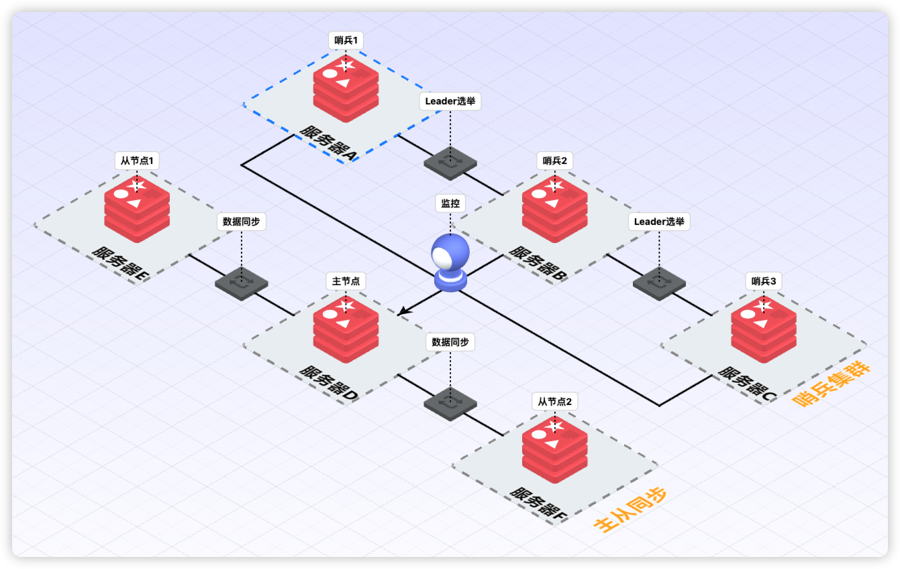
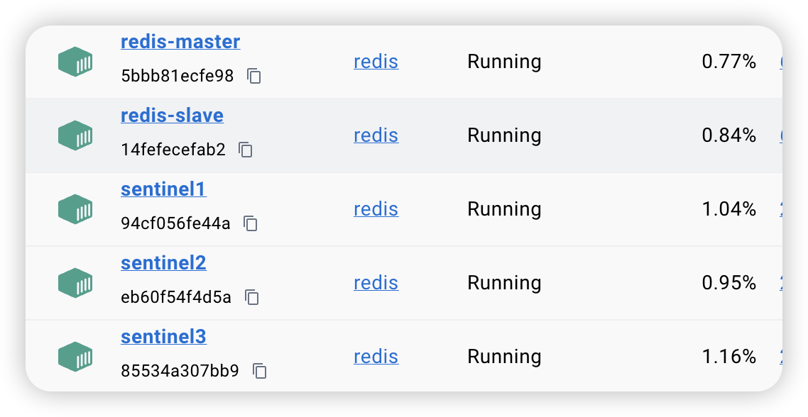
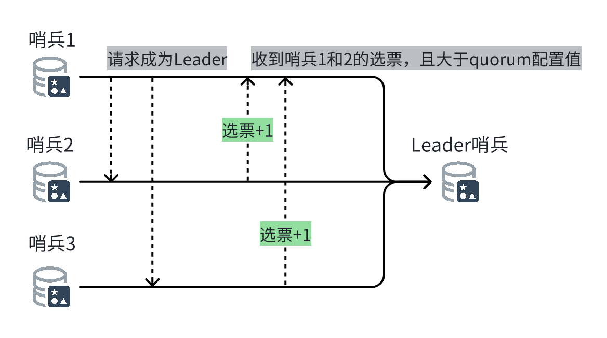
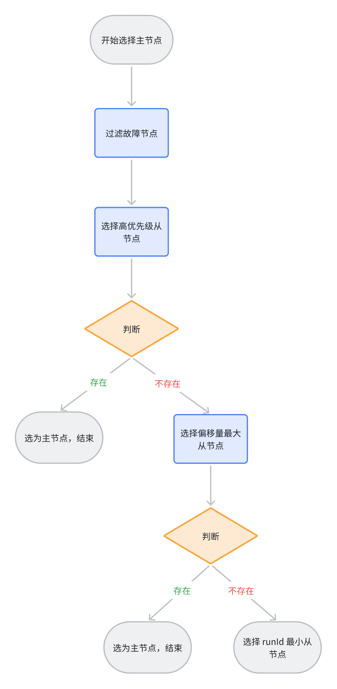

# 机器故障了怎么办？
Redis 是内存数据库，我们知道可以通过持久化机制，保存快照或者保存记录日志的方式，将数据持久化到磁盘。但是，如果机器故障了或磁盘坏了，数据就不就全没了吗？这种情况应该怎么办呢？别担心，考虑**主从模式**。

## 主从模式

给主节点 Master 配置一个从节点 Slave，当 Master 挂了以后，Slave 可以顶上。通常如果是小规模应用，从节点只配置一个，提供基础备份功能。

假设我们现在有两台机器，A 和 B。在 B 机器上，通过如下命令，可以将 B 设置为 A 的从节点：

```bash
# 连接 B 机器的 Redis 命令交互行
$ redis-cli
# 将 B 设置为 A 的从节点
127.0.0.1:B> slaveof 127.0.0.1 A
# 验证主从配置
127.0.0.1:B> info replication
# 输出如下信息代表设置成功
role:slave
master_host:127.0.0.1
master_port:6379
master_link_status:up
...
```

接下来，让我们一起通过 Docker 进行实验：

```bash
# 创建一个网络
$ docker network create redis-net
# 启动 Master 节点
$ docker run -d --name redis-master \
--network redis-net \
    -p 6379:6379 \
    redis redis-serve
# 启动 Slave 节点
$ docker run -d --name redis-slave \
--network redis-net \
    -p 6380:6379 \
    redis redis-server --slaveof redis-master 6379

# 连接主节点并验证主从配置
$ docker exec -it redis-slave redis-cli -h redis-master
# 验证主从配置
127.0.0.1:6379> info replication
# 输出如下信息代表设置成功
# Replication
role:master
connected_slaves:1
slave0:ip=172.18.0.3,port=6379,state=online,offset=42,lag=0

# 连接从节点同上，不赘述，输出如下信息代表设置成功
# Replication
role:slave
master_host:redis-master
master_port:6379
master_link_status:up
```

验证从节点是否同步了主节点的数据：

```bash
127.0.0.1:B> GET skey
(nil)
127.0.0.1:A> SET skey abc
OK
127.0.0.1:B> GET skey
"abc"
```

通过上述实验，我们可以看到，从节点已经同步了主节点的数据。那主节点之前就有的数据，是否也会同步到从节点呢？

答案是**会**。让我们再进行一次实验：

```bash
# 将 B 从 A 的从节点设置为独立节点
127.0.0.1:B> SLAVEOF on one
OK
# 输出如下信息代表设置成功
127.0.0.1:B> info replication
# Replication
role:master
connected_slaves:0
master_failover_state:no-failover
...
# 在主节点 A 新增键值对并查询（请自己新增数据，这里忽略了）
127.0.0.1:A> keys *
1) "skey"
2) "bkey"
3) "akey"
# 在 B 节点查询键值对，只有之前同步的键值对
127.0.0.1:B> keys *
1) "skey"
# 重新将 B 设置为 A 的从节点
127.0.0.1:B> slaveof redis-master 6379
OK
# 在 B 节点查询键值对，所有键值对都同步过来了
127.0.0.1:B> keys *
1) "skey"
2) "bkey"
3) "akey"
```

有了从节点，在主节点发生故障的时候，我们就可以把项目中 Redis 的连接配置，从原来的主节点修改为从节点。但是，我们什么时候才知道主节点发生故障呢？最简单的方式就是写一些脚本进行监测，当主节点挂了以后，自动将项目中 Redis 的连接配置从主节点修改为从节点。不过，这种监控以及故障转移的能力，Redis 已经有了完整解决方案：**哨兵模式**。

## 哨兵模式

它由一个或多个哨兵实例组成，用于监控 Redis 主节点和从节点，并在主节点发生故障时自动进行故障转移。本质上，Redis 的哨兵模式就是一个 Redis 进程，只是启动参数不同和职责不同。哨兵模式的 Redis 进程不负责数据存储，它主要负责三件事：

1. 监控主从节点是否正常运行；
2. 通过发布订阅模式，将故障转移的结果通知给订阅者；
3. 当主节点发生故障时，自动进行故障转移，选择一个最合适的从节点升级为主节点，并通知应用方更新配置。

下图为哨兵和主从的工作模式：



接下来，我们继续用 Docker，搭建一个哨兵集群，用于监控我的主从同步 Redis 集群，然后，模拟主从同步中的主节点挂掉了，从节点被选举为新的主节点。

1. 启动 Redis 主从集群

    前面已经介绍过，不再赘述。

2. 查看 Redis 主节点 IP

    ```bash
    $ docker inspect redis-master | grep IPAddress
    ```

3. 创建三个哨兵的配置文件
    ```bash
    # 创建三个哨兵的配置文件，172.18.0.2 请修改为自己的 Redis 主节点 IP
    $ cat > sentinel1.conf << EOF
    sentinel monitor mymaster 172.18.0.2 6379 2
    sentinel down-after-milliseconds mymaster 5000
    sentinel failover-timeout mymaster 60000
    sentinel parallel-syncs mymaster 1
    EOF

    # 复制配置文件
    $ cp sentinel1.conf sentinel2.conf
    $ cp sentinel1.conf sentinel3.conf
    ```
    配置说明：
    - sentinel monitor mymaster 172.18.0.2 6379 2：表示监控的主节点 IP 为 172.18.0.2，端口为 6379，至少有 2 个哨兵认为主节点挂了，才能进行故障转移；
    - sentinel down-after-milliseconds mymaster 5000：哨兵发现主节点 5 秒没有响应，就认为主节点故障；
    - sentinel failover-timeout mymaster 60000：故障转移超时时间；
    - sentinel parallel-syncs mymaster 1：表示在进行故障转移时，最多有 1 个从节点参与同步。
4. 启动三个哨兵
    ```bash
    $ docker run -d --name sentinel1 \
    --network redis-net \
    -p 26379:26379 \
    -v $(pwd)/sentinel1.conf:/etc/redis/sentinel.conf \
    redis redis-sentinel /etc/redis/sentinel.conf

    $ docker run -d --name sentinel2 \
    --network redis-net \
    -p 26380:26379 \
    -v $(pwd)/sentinel2.conf:/etc/redis/sentinel.conf \
    redis redis-sentinel /etc/redis/sentinel.conf

    $docker run -d --name sentinel3 \
    --network redis-net \
    -p 26381:26379 \
    -v $(pwd)/sentinel3.conf:/etc/redis/sentinel.conf \
    redis redis-sentinel /etc/redis/sentinel.conf
    ```
 
    启动后，你会看到哨兵容器日志中，有如下信息：

    ```bash
    WARNING: Sentinel was not able to save the new configuration on disk!!!: Device or resource busy
    ```

    这个警告信息可以忽略，不影响使用，这个警告是因为在 Docker 容器中，Redis Sentinel 无法将更新后的配置写回配置文件。这是因为我们使用的是只读卷挂载。

    到此为止，我们启动的容器如下图所示。

    

5. 模拟主节点故障
    ```bash
    # 停止 Redis 主节点
    $ docker stop redis-master

    # 连接原从节点验证是否已升级为主节点
    $ docker exec -it redis-slave redis-cli
    127.0.0.1:6379> info replication
    # Replication
    role:master
    connected_slaves:0
    ...
    ```

6. 恢复原主节点
    ```bash
    # 启动原主节点
    $ docker start redis-master

    # 查看原主节点状态（此时变成了从节点）
    $ docker exec -it redis-master redis-cli
    127.0.0.1:6379> info replication
    # Replication
    role:slave
    master_host:172.18.0.3
    master_port:6379
    ...
    ```

### Leader 哨兵的选举策略
发生故障后，哨兵集群会动态产生一个 **Leader 哨兵**，由它执行主从同步的故障转移，即最适合的从节点升级为新主节点，并通知其他哨兵和客户端配置更新。请注意，Leader 身份是**临时的**，**动态的**，完成故障转移后，所有哨兵又恢复平等地位，下次故障时重新选举，这种设计是为了避免多个哨兵同时执行故障转移和故障转移的一致性。**Leader 哨兵** 的选举如下图所示。



当一个哨兵节点确定 Redis 集群的主节点下线后，会请求其他哨兵将自己选举为 Leader，被请求的哨兵如果没有同意过其他哨兵节点的选举请求，就会同意请求，也就是选票+1。

如果某个哨兵节点获得了超过半数哨兵节点的选票，且大于 quorum 配置值[1]，就会成为 Leader 哨兵，否则重新进行选举。

### Leader 哨兵选择新主节点策略
当哨兵集群选举出 Leader 哨兵后，它将从主从同步的 Redis 集群中，选择一个节点作为新的主节点，选择策略优先级如下：
1. 过滤故障节点，故障节点包括网络状态不好的节点；
2. 选择 replica-priority 优先级最高的从节点。replica-priority（Redis 旧版本叫作 slave-priority）是 Redis 从节点的一个启动配置参数，默认值 100，取值范围 0-100；
3. 选择偏移量最大的从节点。偏移量记录写了从节点写了多少主节点的数据，偏移量越大，同步的数据越多，主从偏移量相同，则数据完全同步；
4. 选择 runId 最小的从节点作为主节点。runId 是 Redis 每次启动随机生成的 Redis 标识。



## 参考资料

[1] [Redis 集群配置：https://redis.io/docs/latest/topics/cluster-config/](https://www.w3cschool.cn/redis_all_about/redis_all_about-9tgp271d.html)
