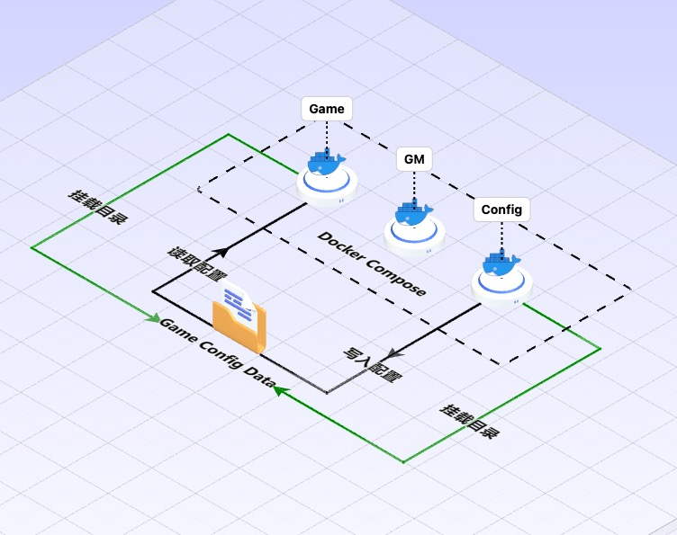

## 冷启动阶段，热更新后端游戏配置方案

选择将生成配置功能与 GM 后台分为两个容器部署，原因如下。
- GM 容器专注后台服务
- 从 Gitlab 权限视角来说，GM 不应该有访问代码仓库的敏感权限
- 容器中添加 dotnet-sdk(执行 luban 必要环境)，会显著增加镜像大小（dotnet-sdk:8 在 1GB 以上）

在 Docker Compose 环境中，Game 容器和 Gen Config 容器挂载 Game Config Data 目录，Game 容器只负责读取，Gen Config 只负责写入。

