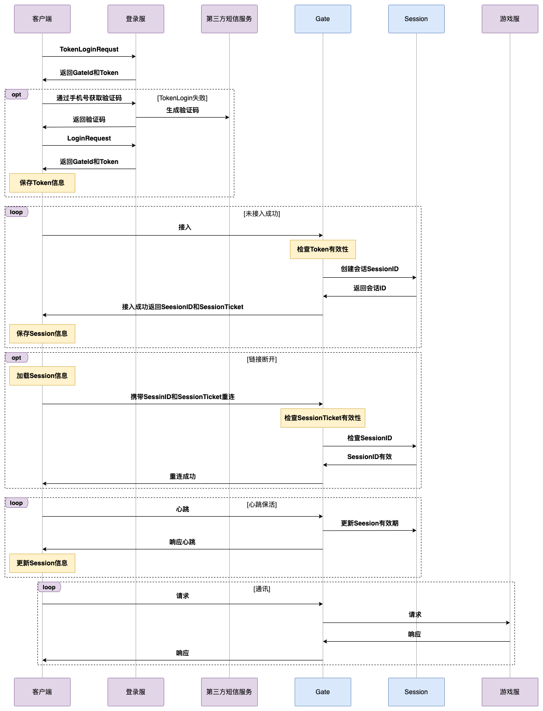

# 游戏登录系统设计

## 确定设计范围

### 游戏预计有多少用户？
参考深空之眼，总注册在 300 万到 400 万之间。

### 游戏有多少种登录方式？
仅通过手机号登录和注册。

### 同一个手机号能否注册多次？
不可以，最多一次。

### 如何生成账号的唯一标识？
通过雪花算法生成唯一标识，相比 UUID，雪花算法的优势如下：
- 全球唯一性更强
游戏会上台服、日服、韩服和国服
- 不需要考虑时钟回拨
时钟回拨：服务器的系统时间突然回到了过去的某个时间点
- 生成速度比 UUID 更快
  - 纯数字计算；
  - 只需要 8 字节（16位），而 UUID 需要 16 字节（128位）或 32字节（字符串形式）。
- 数据库友好
  - 基于时间戳生成，天然有序；
  - 数字索引比字符串索引效率高。

### 公司其他游戏是否可以使用同一个账号？
仅考虑一款游戏。

### 其他
- 会在分布式环境下工作；
- 登录系统是一个单独的服务。

## 高层次的设计方案
### 玩家视角的登录流程

#### 玩家在首次登录
- 点击游戏应用
- 客户端获取各种手机权限
- 输入手机号 （运营商有一键登录）
- 弹窗用户协议和隐私政策
- 获取验证码，如果手机号未注册过，直接注册
- 加载游戏资源
- 展示公告
- 进入游戏
- 创建游戏角色
  - 昵称
  - 职业

#### N 天内，玩家非首次登录
- 点击游戏应用
- 加载游戏资源
- 进入游戏

### 开发视角的登录流程
- Token 需要具有时效性
  - 同一台设备，N 天内，玩家不用每次登录都需要输入密码
  - 和上一次设备不一样，必须重新获取验证码登录
- 需要接入第三方服务
  - 短信、运营商一键登录
- 登录流程中可以查看公共数据
  - 公告
- 登录后，需要保存玩家登录设备和上一次登录时间
  - 校验是否需要颁发新的 Token

## 深入设计

### 安全
- Token 不支持续期；
- Token 中的有效载荷，携带玩家设备唯一 ID，判断玩家的设备与上一次使用的设备是否一致，不一致则要求重新获取验证码。

### 切换账号
在【进入游戏】界面，点击切换账号，可以查看到近期在该设备中登录过的手机号。

### 忘记密码

### 连接即身份
假设 Token 有效期为 30 天，建立连接后，31 天未下限，一直保持连接，不会强制重新验证 Token。这里其实可以考虑防沉迷和禁止多设备登录兜底。避免盗号场景下，盗号人一直不下线。

## 架构图

## 时序图

