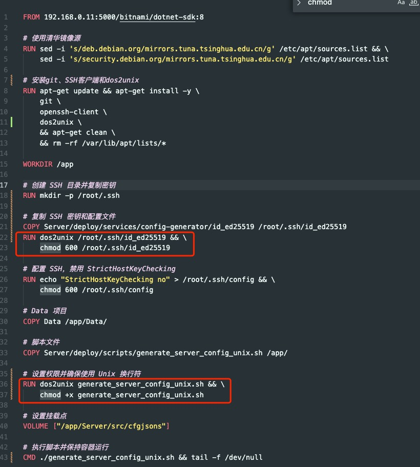

今天在 Win 下使用 docker 踩了不少坑，把耗费时间最久的拿出来记录一下。

我在 docker 容器中有一个 git 仓库，我希望通过 ssh 的方式拉取项目，一开始，该容器的 .rsa 文件是从宿主机复制的，宿主机可以拉取仓库代码，但是容器不行。

于是，我移除了原来的 rsa 文件，在容器中，新生成了一个 rsa 密钥，并配置到 git 仓库的 ssh 中。此时，容器中可以拉取仓库最新代码。

我把这些 .rsa 文件保存到宿主机，并让容器镜像构建时，使用刚才在容器中生成的 .rsa 文件，构建镜像后，启动容器，发现又不能拉取仓库代码了，我可以确定文件是同一个，并且权限是正确的， git pull 还是无法拉取。

我通过 cat -A，发现 Windows 上运行的 Docker，执行 dockerfile 的 COPY 关键词时，会偷偷加一个 $ 换行符，直接打开看，还看不到。

这是编码问题，在类 Unix 的系统上执行，是不会有这个问题的。Mac 和 Win 差别还是太大了，今天做了一下午的兼容处理，如下。

- Win 复制到镜像中的脚本不可使用；
- Win 的 COPY 会改变源文件的编码格式，肉眼不可见；
- Win 的 volums 不支持权限配置，比如 ssh:ro，在 Win 的镜像中去看，文件居然是 777 的权限

用 Win 主要因为开发游戏过程中，需要跑 Unity，Mac 跑 Unity 装虚拟机的话，M3 Max 芯片都烫。

如何解决这个问题呢，我目前的解决方案是使用 dos2unix 转换一下。如果你的容器需要在类 Unix 环境下工作，而宿主机是 Win，建议文本内容都转换一下，比如，脚本和密钥等。

